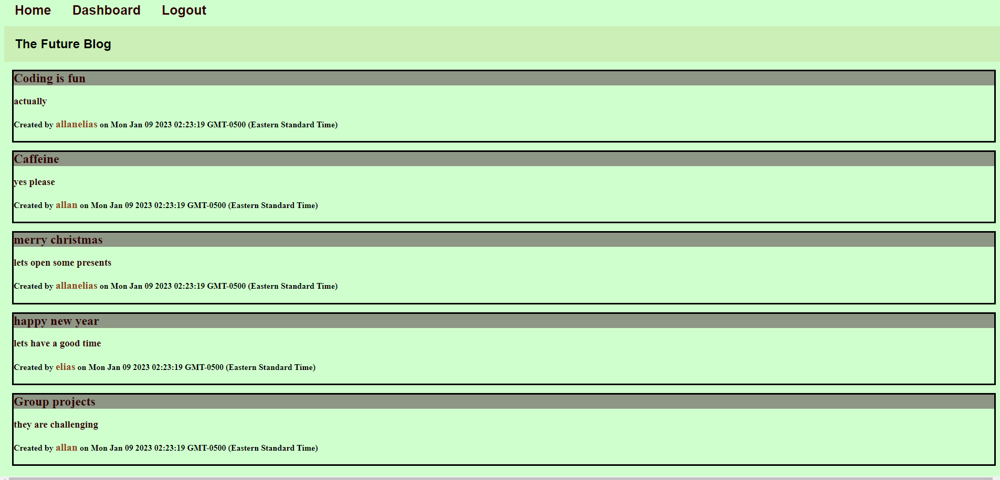
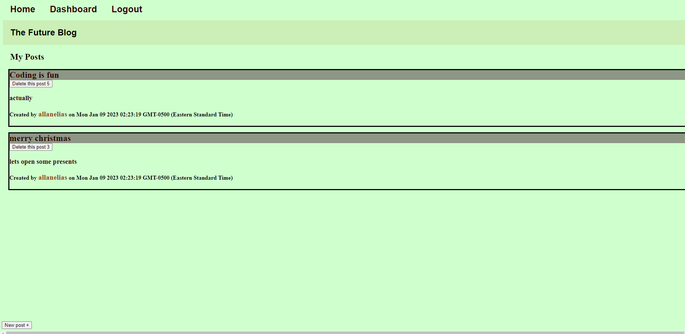

[](https://opensource.org/licenses/MIT)

https://opensource.org/licenses/MIT

# The Future Blog

## Description 
This is a blog-style website that was created as a homework for module 14 of the coding bootcamp. It was created with the idea of publishing articles, blog posts and thoughts and opinions.

## Installation  
```md
make sure you're inside the root folder using the cd(change directory) command
run npm -i on your terminal 
Rename .env.EXAMPLE to .env and fill in the blank spaces
create database by running mysql -u root -p < db/schema.sql on the terminal
run seed file by running npm run seed on the terminal
run the server file by runnin npx nodemon server on the terminal
```

## Technologies
This website was made by connecting the dynamic and responsive front-end using HTML, CSS (Bootstrap) and JavaScript, to the responsive and interactive back-end using Handlebars.js (as the template engine), MySQL and the Sequelize ORM (for the database), GET and POST routes (for adding new data and retrieving) and utilized session authentication. This website is powered by Heroku.

## Screenshots 

The following images show the mock-up of the generated HTML’s appearance and functionality:






## Usage  
Go to home to see all posts, go to dashboard to see all posts created and delete them. If you click on a post you can see the comments.

## Contributing 
E-mail me to talk about working together !

## Tests
no tests were made for this app

## License
This application is covered by the MIT license

## Questions
https://github.com/EliasAllan

or

E-mail me at: allanrnelias@gmail.com

## Table of contents
- [Description](#description)
- [Installation](#installation)
- [Usage](#usage)
- [Contributing](#contributing)
- [Tests](#tests)
- [License](#license)
- [Questions](#questions)

## Deployed application link

https://the-future-blog.herokuapp.com/